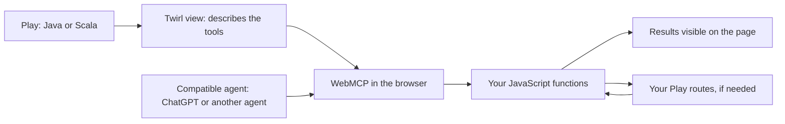
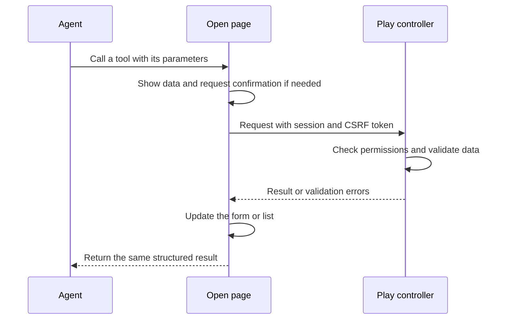
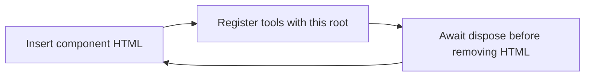

# play-webmcp

[](https://github.com/HackInvent/play-webmcp/actions/workflows/ci.yml)
[](https://github.com/HackInvent/play-webmcp/releases)
[](LICENSE)


**Add WebMCP tools to the views of an existing Play 2.8, 2.9, or 3.0 Java or Scala application.** A compatible agent can call these tools while the user sees the results on the same page.

The module provides Twirl helpers and a small JavaScript file with no browser dependencies. You choose which actions to expose and reuse your application's JavaScript, routes, and permissions.

**Experimental version 0.5.0.** WebMCP is still evolving. Play compatibility and browser/agent availability are separate: installing the module does not enable WebMCP in the visitor's browser.

## Contents

- [How it works](#how-it-works) and [prerequisites](#prerequisites)
- [Install in a Java or Scala site](#installation) and [register your first tool](#your-first-tool-in-two-files)
- [Keep classic scripts or jQuery](#alternative-keep-classic-scripts-or-jquery) and [existing asset setups](#keep-your-existing-site-structure)
- [Java and Scala APIs](#java-and-scala-apis), [existing forms](#add-webmcp-to-an-existing-form), and [Play actions](#reuse-your-actions-and-display-the-result)
- [Browser and agent compatibility](#browsers-and-agents)
- [Dynamic views](#components-and-pages-updated-without-a-reload) and [JavaScript API reference](#javascript-api-reference)
- [Run the examples](#try-the-java-and-scala-applications), [develop and test](#development-and-testing), and [upgrade](#upgrading)
- [Troubleshooting](#troubleshooting) and [contributing](#contributing-and-license)

## How it works



Choose how to expose the action:

| Mode | Use case | Helper |
| --- | --- | --- |
| JavaScript, known as **imperative** | Call your functions and return a structured result. Start here for search, dashboards, and ChatGPT integration. | `WebMcp.tool(...)` then `registerTools(...)` |
| HTML, known as **declarative** | Let a browser with declarative support use an ordinary form. | `WebMcp.formAttributes(...)`; no runtime script needed for this mode |

For imperative tools, use either ES modules or [classic scripts](#alternative-keep-classic-scripts-or-jquery). Both expose the same tools. Your project's Java or Scala language does not determine which script style to use.

The library does not send anything to an AI provider. The agent uses the page with the user's permissions and session. A remote MCP client that does not visit the page needs additional integration: this module does not provide a remote MCP server.

## Prerequisites

To integrate the module, you need an existing Play application with **Twirl HTML views**, a compatible JDK and sbt build, and a route that serves `public/` files.

| Play releases checked | Module artifact | Scala families | JDKs checked |
| --- | --- | --- | --- |
| **3.0.0–3.0.11** | `play-webmcp` | 2.13, 3 | 11, 17, 21 |
| **2.9.0–2.9.11** | `play-webmcp-play29` | 2.13, 3 | 11, 17, 21 |
| **2.8.0–2.8.22** | `play-webmcp-play28` | 2.12, 2.13 | 8, 11 |

Choose the artifact for your **Play version**, even in a Java application. The helpers, JavaScript API, and public asset paths are the same in all three. Keep your site's existing compatible Play, Scala, sbt, and JDK versions. See [the test matrix](#development-and-testing) for the combinations checked.

The Play 2.8 JARs target Java 8 bytecode and are built with Scala **2.12.10 / 2.13.1**. The Play 2.9 and 3.0 JARs target Java 11 and are built with Scala **2.13.12 / 3.3.1**. Java projects also use Scala for Play and Twirl; `%%` in sbt selects the correct Scala artifact.

The installation tests use **sbt 1.3.13** for Play 2.8.0–2.8.7 and **1.5.8** for Play 2.8.8–2.8.22. Play 2.9 and 3.0 are tested with **1.11.7**, plus **1.9.9** on their first releases. These are tested setups, not instructions to replace your working build tool.

Play 2.0–2.7 and Play 1.x are not covered by these JVM artifacts. Move those applications to one of the listed Play lines before installing the module. This release adds module compatibility; it does not change the upstream maintenance status of your Play version.

To use the tools:

- **HTTPS**, or `localhost` for development.
- WebMCP enabled in the browser and an agent that can use it.
- The page open, with the user signed in to your application if required.
- The `tools` permissions policy must allow the page; its default is `self`. Do not disable origin isolation with `Origin-Agent-Cluster: ?0`. You do not need to add COOP/COEP just for this module.

Node.js is useful **for developing and testing this repository**, but is not required to integrate the library or run your Play application. References: [Play 2.8 requirements](https://www.playframework.com/documentation/2.8.x/Requirements), [Play 2.9 requirements](https://www.playframework.com/documentation/2.9.x/Requirements), [Play 3 requirements](https://www.playframework.com/documentation/3.0.x/Requirements), [WebMCP requirements](https://developer.chrome.com/docs/ai/webmcp).

## Installation

**Add the dependency to your existing site; you do not need to clone this repository.** Start with one page and one action. The steps are the same for Java and Scala projects.

| File in your application | Change |
| --- | --- |
| `build.sbt` | Add the Maven resolver and library dependency. |
| `conf/routes` | Reuse your assets route, or add one if it is missing. |
| Your existing `.scala.html` view or layout | Describe the tool and load its JavaScript. |
| `public/javascripts/page-tools.js` | Connect the tool to your JavaScript function. |

### 1. Add the dependency

In your **Java or Scala** application's `build.sbt`, add the resolver once:

```scala
resolvers += "play-webmcp releases" at
  "https://raw.githubusercontent.com/HackInvent/play-webmcp/maven"
```

Then choose **exactly one** dependency for your Play version. These are alternatives; installing several together would put duplicate classes and assets on the classpath.

**Play 3.0.x:**

```scala
libraryDependencies += "io.github.alexusel" %% "play-webmcp" % "0.5.0"
```

**Play 2.9.x:**

```scala
libraryDependencies += "io.github.alexusel" %% "play-webmcp-play29" % "0.5.0"
```

**Play 2.8.x:**

```scala
libraryDependencies += "io.github.alexusel" %% "play-webmcp-play28" % "0.5.0"
```

The double `%%` selects the artifact for your Scala version, including in Java projects. This version is distributed through the project's public Maven repository, **not Maven Central**. The JARs are also available in the [GitHub releases](https://github.com/HackInvent/play-webmcp/releases).

The repository is hosted by **HackInvent**. The Maven group ID `io.github.alexusel` is preserved so that projects already using the library remain compatible.

Restart sbt after adding the dependency. The library declares Play as a provided dependency: your application supplies its own Play version. Keep your existing `PlayJava` or `PlayScala` plugin, controllers, dependency injection, session settings, and server backend. No WebMCP plugin, Guice module, API key, or additional server is needed.

For a build with several subprojects, put **both settings on the Play subproject that renders the views**, not just on the root that aggregates them. Merge them into that project's existing `.settings(...)`. For example, a Java subproject could contain:

```scala
lazy val site = (project in file("site"))
  .enablePlugins(PlayJava)
  .settings(
    resolvers += "play-webmcp releases" at
      "https://raw.githubusercontent.com/HackInvent/play-webmcp/maven",
    libraryDependencies += "io.github.alexusel" %% "play-webmcp" % "0.5.0"
  )
```

Use your existing project name and directory, substitute the artifact chosen above, and keep `PlayScala` for a Scala application. If the module is already installed, follow [Upgrading](#upgrading).

### 2. Reuse your assets route

If your application does not already serve static files, add this route to `conf/routes`:

```text
GET   /assets/*file   controllers.Assets.versioned(path="/public", file: Asset)
```

The library's JavaScript is bundled in the JAR and extracted by Play to `lib/play-webmcp/play-webmcp.js`. Do not add a second route if your assets route already exists. Do not include `0.5.0` in this public path. A second file, `lib/play-webmcp/play-webmcp.global.js`, supports classic scripts. If you use `Assets.at` or `AssetsFinder`, use the [matching URL helper](#keep-your-existing-site-structure) in the next step.

## Your first tool in two files

This example works in the views of both **Java and Scala** projects. It lets the agent read the page title.

### 3. Describe a tool in your existing view

In your `.scala.html` view, add the imports after the usual template parameters:

```scala
@import playwebmcp.Tool
@import playwebmcp.javadsl.WebMcp
```

Then place the helper and script **inside your layout's HTML content**, for example inside the `@main(...) { ... }` block or before `</body>`. They must not appear before the page's `<!doctype html>`.

```scala
@WebMcp.tool(
    Tool.create(
        "get_page_title",
        "Read the title of the open page.",
        """{"type":"object","properties":{},"additionalProperties":false}""",
        "getPageTitle"
    ).withReadOnly(true)
)

<script id="page-tools" type="module"
        data-webmcp-runtime="@controllers.routes.Assets.versioned("lib/play-webmcp/play-webmcp.js")"
        src="@controllers.routes.Assets.versioned("javascripts/page-tools.js")"></script>
```

Load this script once per page. If your shared layout already loads it, add only the tool metadata to the individual view. This first example does not require a new controller or route.

### 4. Connect the JavaScript handler

Create `public/javascripts/page-tools.js`:

```javascript
try {
  const runtimeUrl = document.getElementById('page-tools').dataset.webmcpRuntime;
  const { registerTools } = await import(runtimeUrl);

  const tools = await registerTools({
    getPageTitle: async () => ({ title: document.title })
  });

  console.log(tools.supported, tools.api, tools.registered);
} catch (error) {
  console.error('WebMCP registration failed', error);
}
```

`get_page_title` is the name the agent sees. `getPageTitle` identifies your JavaScript function. The helper writes JSON into the page; the runtime connects that description to the function you provide.

Without WebMCP, `supported` is `false` and the page keeps working. With the API available, a configuration mistake such as an unknown handler name throws an explicit error. The `catch` above reports it without interrupting your other scripts.

### 5. Check the integration

1. Start your application and open the page. Its usual buttons and forms should still work.
2. In the browser's Network tab, check that `page-tools.js` and the selected runtime (`play-webmcp.js` or `play-webmcp.global.js`) return HTTP 200 with a JavaScript content type.
3. In a browser with WebMCP enabled, check the console: `supported` should be `true` and `registered` should include `get_page_title`.
4. Use a compatible agent or the browser's tool inspector to call `get_page_title`. It should return the visible page title. Without WebMCP, `supported: false` is expected.

For a site served under a prefix such as `/shop`, keep its existing `play.http.context` and proxy configuration. Generate the script and action URLs with Play's route helpers, as shown here. Do not hard-code `/assets` or `/api` in your handlers. The browser tests run the Java and Scala examples both at `/` and under `/shop`.

For the ES module example, the console should show the equivalent of:

```text
true  "document.modelContext"  ["get_page_title"]
```

An older implementation may report `"navigator.modelContext"`. Without the API, the expected output is `false null []`. A registered tool confirms the page integration; you still need to verify that your chosen agent can discover and call it.

Next, replace the title handler with a function that calls an existing action and updates your page. The [form example](#add-webmcp-to-an-existing-form) and [request flow](#reuse-your-actions-and-display-the-result) show how to reuse validation, permissions, session cookies, and CSRF protection.

### Alternative: keep classic scripts or jQuery

Since **0.4.0**, you can call `window.PlayWebMcp.registerTools` from a classic script. Your existing JavaScript can keep its current loading style. Tool metadata and the Java/Scala helpers stay the same.

Choose this option instead of the ES module script above. Keep the tool metadata from step 3, then load these two external files in order:

```scala
<script defer src="@controllers.routes.Assets.versioned("lib/play-webmcp/play-webmcp.global.js")"></script>
<script defer src="@controllers.routes.Assets.versioned("javascripts/page-tools.js")"></script>
```

Use your existing asset helper for these URLs, including `Assets.at` or `AssetsFinder`. `defer` preserves their order and waits until the page HTML is parsed. If your adapter calls existing application functions, load their script before the adapter too.

For this option, `public/javascripts/page-tools.js` contains:

```javascript
(function () {
  window.PlayWebMcp.registerTools({
    getPageTitle: function () {
      return { title: document.title };
    }
  }).then(function (tools) {
    console.log(tools.supported, tools.registered);
  }).catch(function (error) {
    console.error('WebMCP registration failed', error);
  });
})();
```

Wrap your existing code in a handler that accepts the tool's parameters and returns its result. jQuery calls can stay inside that handler. No function is discovered automatically on `window`. The classic runtime adds only the `PlayWebMcp` namespace; the example keeps its own functions inside a closure.

Both files provide the same `registerTools` options, including `root`, `signal`, and `dispose()`. The classic runtime is generated from the same implementation as the ES module. Choose one loading mode for a view to avoid registering its tools twice.

Both runtimes use modern JavaScript. If an older minifier cannot parse them, serve the selected runtime as a separate asset outside that optimizer. Keep your existing CSP and add your usual nonce to the external script tags if required. WebMCP still requires a compatible modern browser and agent.

## Keep your existing site structure

The first-tool example uses `Assets.versioned`. If your application uses `Assets.at` or an injected `AssetsFinder`, use that same helper for **both JavaScript URLs**:

| Existing asset setup | Example runtime URL expression in Twirl |
| --- | --- |
| `Assets.versioned` with the route above | `@controllers.routes.Assets.versioned("lib/play-webmcp/play-webmcp.js")` |
| `Assets.at` with a fixed `/public` route | `@controllers.routes.Assets.at("lib/play-webmcp/play-webmcp.js")` |
| An `AssetsFinder` passed as `assetsFinder` | `@assetsFinder.path("lib/play-webmcp/play-webmcp.js")` |

This also works with a custom assets route such as `/static/*file`. Keep your existing asset pipeline and CSP. The template passes the runtime URL to JavaScript, so the handler file does not have to assume where assets are hosted. See [Play's asset documentation](https://www.playframework.com/documentation/3.0.x/AssetsOverview) for route overloads and asset configuration.

| Existing setup | Integration |
| --- | --- |
| An existing Play 2.8.x, 2.9.x, or 3.0.x site | Add the matching dependency to the Play subproject. Keep its compatible Play, Scala, sbt, and JDK versions. |
| Classic JavaScript or jQuery | Use the [classic script option](#alternative-keep-classic-scripts-or-jquery). Keep your existing scripts and add a small adapter for the tool. |
| `Assets.at` | Keep the route and generate both script URLs with `Assets.at`. The Java example uses this setup. |
| An injected `AssetsFinder` | Keep passing it to the view and use `assetsFinder.path(...)`. The Scala example uses this setup. |
| Assets built separately or served by a CDN | Download the matching JavaScript file from the [release](https://github.com/HackInvent/play-webmcp/releases), then serve it through your existing asset pipeline. Use that URL in the view. |
| Play 2.0–2.7 or Play 1.x | These versions are outside the published compatibility range; upgrade to a listed Play line first. |

For `AssetsFinder`, `play.assets.urlPrefix` must match the public asset URL, including any site prefix. For example, a site deployed at `/shop` with an `/assets/*file` route uses:

```hocon
play.http.context = "/shop"
play.assets.path = "/public"
play.assets.urlPrefix = "/shop/assets"
```

The route still uses `/assets/*file`; Play adds the HTTP context. `AssetsFinder` reads the configured asset prefix separately. Reuse your site's existing values when they already work. See [Play's asset configuration](https://www.playframework.com/documentation/3.0.x/AssetsOverview#Using-configuration-and-AssetsFinder).

## Java and Scala APIs

You can prepare the metadata in a Java controller and pass the object to the view:

```java
import playwebmcp.Tool;

Tool search = Tool.create(
    "search_products",
    "Search for products by name.",
    "{\"type\":\"object\",\"properties\":{\"query\":{\"type\":\"string\"}},\"required\":[\"query\"]}",
    "searchProducts"
).withReadOnly(true);
```

The view accepts `@(search: playwebmcp.Tool)` and renders `@playwebmcp.javadsl.WebMcp.tool(search)`. See the [complete Java controller](examples/java/app/controllers/javaexample/HomeController.java) and its [view](examples/java/app/views/javaIndex.scala.html).

The Scala API accepts a Play JSON object directly:

```scala
import play.api.libs.json.Json
import playwebmcp.scaladsl.WebMcp

val metadata = WebMcp.tool(
  name = "search_products",
  description = "Search for products by name.",
  inputSchema = Json.obj(
    "type" -> "object",
    "properties" -> Json.obj("query" -> Json.obj("type" -> "string")),
    "required" -> Json.arr("query")
  ),
  handler = "searchProducts",
  readOnly = true
)
```

`metadata` is a Twirl `Html` value, rendered with `@metadata`. You can also call the helper directly in the view, as in the [Scala example](examples/scala/app/views/scalaIndex.scala.html).

The schema describes the expected parameters; it does not replace server validation. Tool names must contain 1 to 128 ASCII letters, digits, dots, hyphens, or underscores. Descriptions are required. JavaScript functions are provided explicitly, without `eval` or automatic lookup in global variables.

| Helper | Purpose |
| --- | --- |
| Java `Tool.create(name, description, inputSchemaJson, handler)` | Build metadata from a JSON schema string. It does not execute an action. |
| Java `tool.withReadOnly(true)` | Return a new tool with a hint that the action only reads data. Keep the returned value. |
| Java `WebMcp.tool(tool)` / Scala `WebMcp.tool(...)` | Render metadata as a Twirl `Html` value. |
| `WebMcp.formAttributes(name, description, autoSubmit)` | Render form attributes; `autoSubmit` defaults to `false` when omitted. |
| `WebMcp.paramDescription(description)` | Describe an existing form field to the agent. |

Both APIs escape their output. Render the returned `Html` directly in Twirl; do not build the JSON script or HTML attributes by string concatenation.

## Add WebMCP to an existing form

Choose this mode when your target browser and agent support declarative tools. The browser reads the form attributes directly, so this form does not need `registerTools` or either runtime file. For ChatGPT, use the JavaScript integration instead; see [browser and agent compatibility](#browsers-and-agents).

```scala
@import playwebmcp.javadsl.WebMcp

<form action="@controllers.routes.SupportController.submit()" method="post"
      @WebMcp.formAttributes("send_support_form", "Fill in a support request.")>
    @helper.CSRF.formField
    <label for="message">Your request</label>
    <textarea id="message" name="message" required
              @WebMcp.paramDescription("Describe the problem to solve.")></textarea>
    <button type="submit">Send</button>
</form>
```

Adjust the controller name to match your existing route. By default, **the user clicks Send**. Passing `true` as the third argument to `formAttributes` adds `toolautosubmit`: use it only for an action you intend to allow automatic submission for.

Attributes are escaped, and the fields remain ordinary HTML fields. A regular submission may navigate to another page. It does not automatically return a JSON result to the agent. For a structured response and ChatGPT support, use an imperative tool as shown in the example applications. The [Chrome declarative API documentation](https://developer.chrome.com/docs/ai/webmcp/declarative-api) also describes `respondWith()`.

## Reuse your actions and display the result



The examples demonstrate a search and a support request. Their JavaScript functions use `fetch`, preserve the session, pass the existing CSRF token, and display the results. The server returns `{ok: true, ...}` or `{ok: false, errors: ...}`. The module preserves the result returned by your function.

The schema's properties become the handler's input object. For example, the `query` property in the search metadata is available as `input.query` in `searchProducts(input, context)`. A handler can return a plain value or a promise. Return JSON-compatible data that tells the agent what happened; a DOM element or an HTTP `Response` object is not a useful result.

The execution context supplied by the browser is passed as the handler's second argument. If a cancellation signal is available, pass `context.signal` to `fetch`, as in the examples. Check `context.signal?.throwIfAborted()` before changing the page or asking for confirmation, and after awaiting a response.

Each caller receives its own result, while only the latest request updates the examples' shared status. Support requests show a pending notice and an explicit message if sending cannot be confirmed. A network failure or cancellation does not prove that the server rejected a write: check its state before trying again. The examples never retry a write automatically.

Keep access checks and validation in your Play actions. A description or `readOnlyHint` helps the agent understand an action; it is not an authorization check. Metadata is visible in the page and must not contain secrets. The examples ask for confirmation before a support request and validate it without storing it.

## Browsers and agents

Official documentation checked on **September 8, 2026**. “Documented” means stated in the official source; it does not mean tested with your account, model, or browser version.

| Environment | Support and limitations | Verification |
| --- | --- | --- |
| **Chrome** | Experimental imperative and declarative APIs. Origin trial since Chrome 149; a local flag is available. | Automated native tests on Chrome for Testing 153.0.8010.12. [Chrome](https://developer.chrome.com/docs/ai/webmcp) |
| **ChatGPT, built-in browser in the desktop app** | Imperative tools on the top-level page are supported depending on product access and model. Declarative forms and iframes are not currently supported. | API compatibility is documented; this project does not claim testing with a ChatGPT account. [OpenAI](https://learn.chatgpt.com/docs/webmcp) |
| **Edge** | WebMCP is listed as an origin trial in the Edge 152 documentation. Using the browser does not guarantee that Copilot will call your tools. | Documented, not tested by this CI. [Microsoft](https://learn.microsoft.com/en-us/microsoft-edge/web-platform/release-notes/152) |
| **Custom agent or extension** | Works if the agent can discover and invoke the page's WebMCP tools. No specific model provider is required. | Test with your agent. [Specification](https://webmachinelearning.github.io/webmcp/) |
| **Firefox, Safari, or a browser without the API** | The page remains usable by people. This project does not claim native WebMCP support. | The scenario without WebMCP is tested in Chromium. |

### With ChatGPT

1. Open your application in the built-in browser of the ChatGPT desktop app.
2. Sign in to your application if needed.
3. Check that **Enable site tools** is on under **Settings → Browser → Permissions**.
4. Open **Site tools → Available site tools** in the browser's address bar and look for `get_page_title`.
5. Try “Read the title of this page” with the first-tool example, or “Search for the product named Clavier” in the demo applications. Their sample product names are in French; “Clavier” means “keyboard”.

Use imperative tools on the top-level page. See the [official page](https://learn.chatgpt.com/docs/webmcp) for currently eligible models, accounts, and versions. Opening the ChatGPT website in a Chrome tab is not equivalent to using its built-in browser.

### With Chrome or Edge

For local Chrome development, enable `chrome://flags/#enable-webmcp-testing`, then restart the browser. For an experimental public deployment, follow the origin trial instructions. **Model Context Tool Inspector**, linked from the [Chrome documentation](https://developer.chrome.com/docs/ai/webmcp), lets you inspect and call the tools. This inspector is separate from Gemini in Chrome.

For Edge, check the version and requirements of the [Microsoft trial](https://developer.microsoft.com/en-us/microsoft-edge/origin-trials/trials/0b76fe60-b266-458e-a285-04e375c0c31a).

### With your own agent

The runtime registers standard WebMCP tools. Your agent uses the discovery and execution interfaces provided by the browser or its extension. The module contains neither a model nor a conversation loop.

Check the API version when writing this client: Chromium 153 expects serialized JSON arguments for `executeTool`, while the September 4 draft describes an object. Choose the format before calling the tool; do not automatically retry a write operation to try another format. The [native test](tests/browser.mjs) illustrates this distinction. Sources: [tested Chromium IDL](https://chromium.googlesource.com/chromium/src/+/153.0.8010.12/third_party/blink/renderer/core/script_tools/model_context.idl), [draft](https://webmachinelearning.github.io/webmcp/).

## Components and pages updated without a reload

Since **0.3.0**, `registerTools(handlers, { root })` can read tool metadata from a single HTML container. This is useful for a cart, search panel, or any view that your application replaces without loading a new page. Each call returns its own registration object. Calling `dispose()` on it removes only the tools registered by that call.

Use a separate `root` for each independent component. Each root includes all its descendants, so registered roots must not overlap. Do not also register the same metadata through a whole-page call. Tool names must still be unique across the page: for example, `cart.read` and `catalog.search`.

Using the same `Tool` and `WebMcp` imports as above, render the metadata inside the component:

```scala
<section id="cart-panel">
    <span data-item-count>2</span> items in your cart
    @WebMcp.tool(
        Tool.create(
            "cart.read",
            "Read the item count displayed in the cart.",
            """{"type":"object","properties":{},"additionalProperties":false}""",
            "readCart"
        ).withReadOnly(true)
    )
</section>
```

In your external JavaScript module, use the `registerTools` import shown in the first-tool example. With classic scripts, use `const { registerTools } = window.PlayWebMcp` after loading the runtime:

```javascript
async function attachCartTools(root) {
  const tools = await registerTools({
    readCart: async () => ({
      items: Number(root.querySelector('[data-item-count]').textContent)
    })
  }, { root });

  return async function detachCartTools() {
    const cleanup = await tools.dispose();
    if (cleanup.remaining.length > 0) {
      throw new Error('Cart tools could not be removed. Reload the page before replacing the component.');
    }
  };
}
```

After inserting the HTML, keep its cleanup function:

```javascript
const detachCartTools = await attachCartTools(document.getElementById('cart-panel'));
```

Before removing or replacing that HTML, run `await detachCartTools()`. Then insert the new component and call `attachCartTools` again. Finish cleanup before mounting the replacement. Your application controls these steps; the module does not watch the DOM or register newly inserted tools automatically.



`root` must be a container in the same document. With WebMCP available, a missing container (`null`) raises an error before any tools are registered. An empty container registers no tools. Omitting `root` keeps the original behavior of reading the whole document. You can also pass your component's `AbortSignal` with `{ root, signal }`; await `dispose()` when you need to check cleanup errors from an older API.

## JavaScript API reference

Both the ES module's `registerTools` export and `window.PlayWebMcp.registerTools` return a promise:

```javascript
const tools = await registerTools(handlers, options);
```

`handlers` is an object of named functions. Its keys match the metadata's **handler** field, such as `getPageTitle`, rather than the agent-facing tool name `get_page_title`. Import the function as shown in the first example, or take it from `window.PlayWebMcp` after loading the classic runtime.

### Options and returned values

| Option | Default | Meaning |
| --- | --- | --- |
| `root` | The page's `document` | Read metadata from this container's descendants. Register again after replacing its content. |
| `signal` | None | An `AbortSignal` that ends this registration's lifetime. Useful when a component is removed. |
| `document`, `navigator` | The browser globals | Override the environment for tests. Ordinary page code can omit these options. |

| Registration value | Meaning |
| --- | --- |
| `supported` | Whether the runtime found a registration API. It does not confirm that an agent is connected. |
| `api` | `"document.modelContext"`, `"navigator.modelContext"`, or `null`. |
| `registered` | Names still registered by this call, updated after cleanup. An empty array can also mean no metadata was found. |
| `cleanupErrors` | Errors from the latest cleanup attempt, each with `{ name, error }`. |
| `await tools.dispose()` | Remove this call's tools and return `{ remaining, errors }`. Await it before replacing the view. |

Without an API, the result has `supported: false`, `api: null`, and empty arrays. `dispose()` remains safe to call. Metadata is not validated in this case, so also check your integration in a browser with WebMCP enabled.

### Errors and cancellation

An invalid definition produces a `TypeError` before any tools are registered. If the browser rejects registration partway through, the runtime attempts to remove tools already added, then throws `PlayWebMcpRegistrationError`. Its `cause` is the original failure; `registered` lists any tools left after cleanup, and `cleanupErrors` explains why they remain.

On an older API, `dispose()` can return nonempty `remaining` and `errors` arrays. Inspect them before registering a replacement. You can retry `dispose()` after resolving the problem; if the browser cannot unregister tools, reload the page.

The `signal` **option** controls how long tools stay registered. A handler's `context.signal`, when supplied by the browser, concerns **one invocation**. Pass that signal to cancellable work such as `fetch`. Removing a tool does not undo a request already processed by the server. See the [request flow](#reuse-your-actions-and-display-the-result) for handling uncertain write results.

## Lifecycle, CSP, and limitations

- Register once per view or component and [finish cleanup before replacing it](#components-and-pages-updated-without-a-reload). The runtime prefers `document.modelContext` and falls back to `navigator.modelContext`. The current API removes tools through an abort signal; the older API needs `unregisterTool`.
- The helper produces inert JSON, and the code runs in an external file. Allow that file in your usual CSP; the module does not require `unsafe-inline` or `unsafe-eval`. If your CSP requires a nonce on external scripts, keep using your application's existing nonce helper.
- Do not give a declarative tool and an imperative tool on the page the same name. The runtime does not manage tools registered by another library.
- Routes do not automatically become tools. Each exposed action and handler must be provided explicitly.
- Play 2.0–2.7, Play 1.x, and Play 3.1 previews are outside the current test matrix. Other Play releases, Scala versions, and browser/agent combinations need verification before they can be claimed as supported.

## Try the Java and Scala applications

```bash
git clone https://github.com/HackInvent/play-webmcp.git
cd play-webmcp
sbt "javaExample/run 19001"
```

Open `http://localhost:19001`. For Scala, use another terminal:

```bash
sbt "scalaExample/run 19002"
```

Open `http://localhost:19002`. Each page contains a search, a support form, and a visible WebMCP status. The Java example uses classic scripts and `Assets.at` under `/static`; the Scala example uses ES modules and an injected `AssetsFinder` under `/assets`. Both use URLs generated by Play. The demo interfaces and sample product names are currently in French. The examples use a fixed product list and do not store requests. Their session keys are local demo keys; use your own configuration when deploying an application.

These commands run the Play 3 examples. The same example sources are compiled against the selected public artifact by `consumer-check.sh`; no Play 3 application code is required in your Play 2 site.

To run the automated browser scenarios against a Play 2 installation, first install the [browser test prerequisites](#development-and-testing), then choose a stack:

```bash
# Uses your JAVA_HOME; choose JDK 8 or 11 for Play 2.8.
PLAY_VERSION=2.8.22 WEBMCP_BROWSER_CHECK=1 bash scripts/consumer-check.sh 2.12.20
# Choose JDK 11, 17, or 21 for Play 2.9.
PLAY_VERSION=2.9.11 WEBMCP_BROWSER_CHECK=1 bash scripts/consumer-check.sh 3.3.6
```

These commands build temporary applications, run the tests, then stop and remove the applications.

To follow an action from the view to the server:

| Example | Tool metadata and page | JavaScript handlers | Play actions |
| --- | --- | --- | --- |
| Java | [Twirl view](examples/java/app/views/javaIndex.scala.html) | [Classic script](examples/java/public/javascripts/app.js) | [Controller](examples/java/app/controllers/javaexample/HomeController.java) |
| Scala | [Twirl view](examples/scala/app/views/scalaIndex.scala.html) | [ES module](examples/scala/public/javascripts/app.js) | [Controller](examples/scala/app/controllers/scalaexample/HomeController.scala) |

## Development and testing

Additional prerequisites: **Node.js 22** for browser tests, npm, and Chromium's system dependencies. With JDK 11, 17, or 21 selected:

```bash
sbt +test
npm ci
npm test
npx playwright install --with-deps chromium
sbt javaExample/stage scalaExample/stage
bash scripts/browser-check.sh
```

After editing the runtime or changing the module version, run `sbt webmcp/clean webmcpPlay28/clean webmcpPlay29/clean javaExample/clean scalaExample/clean` before building the examples again. This removes extracted WebJar files that Play may otherwise reuse.

The last script starts and stops its own applications on ports 19001 and 19002. These ports must be free. To test an application that is already running:

```bash
BASE_URL=http://localhost:19001 npm run test:browser
```

The checks cover:

- Java and Scala APIs, schemas, names, and HTML/JSON escaping.
- The real Play routes and views in both applications, validation, and CSRF protection.
- The runtime with no API, the current API, the older API, cancellation, cleanup errors, and independent component registration. These unit tests use API test doubles.
- The example handlers with delayed responses, network and JSON errors, cancellation, and confirmation. These unit tests use DOM and HTTP test doubles.
- A real browser: forms with and without JavaScript, the asset from the JAR, native WebMCP discovery and calls, component replacement that preserves other tools, confirmation and cancellation of a write operation, delayed support responses, and network failures. These tests do not install a fake WebMCP API and fail if the native API is missing.

The [CI](https://github.com/HackInvent/play-webmcp/actions/workflows/ci.yml) uses JDK 11 to build all six distributable JARs from shared sources: two for each Play line. It checks their bytecode, Play dependency scope, Scala versions, bundled JavaScript, sources, and checksums. Independent Java and Scala applications then install those same JARs:

| Installation check | Versions |
| --- | --- |
| Every stable Play 3.0 release listed above | 3.0.0–3.0.11, Scala 2.13.18 and 3.3.6, Java 11, sbt 1.11.7 |
| Every stable Play 2.9 release listed above | 2.9.0–2.9.11, Scala 2.13.18 and 3.3.6, Java 11, sbt 1.11.7 |
| Every stable Play 2.8 release listed above | 2.8.0–2.8.22, Scala 2.12.20 and 2.13.18, Java 11; sbt 1.3.13 through Play 2.8.7, then 1.5.8 |
| Minimum Scala versions on Play 3.0.0 and 2.9.0 | Scala 2.13.12 and 3.3.1, Java 11, sbt 1.9.9 |
| Oldest Play 2.8 setup | Play 2.8.0, Scala 2.12.10 and 2.13.1, Java 8, sbt 1.3.13 |
| Additional Java 8 coverage | Play 2.8.22, Scala 2.12.20 and 2.13.18, sbt 1.5.8 |
| Additional JDKs | Play 3.0.11 and 2.9.11 with both Scala families on Java 17 and 21 |
| Browser integration | Play 3 examples, Play 2.9.11 / Scala 3, and Play 2.8.22 / Scala 2.12 / Java 8; each with Java and Scala views at `/` and `/shop` |

The browser scenarios include classic scripts with Java `Assets.at`, ES modules with Scala `AssetsFinder`, native tool calls, component replacement, and ordinary forms. They check missing and invalid CSRF tokens as well as successful submissions. The browser version is pinned by `package-lock.json`.

The installation checks compare each application's Play, Scala, Twirl, JSON, and Akka/Pekko dependencies with an equivalent application without this module. They also fail if the test framework does not discover the example suite, which is especially important with older sbt versions.

To build and test all module variants locally with **JDK 11**:

```bash
sbt +webmcp/test +webmcpPlay29/test +webmcpPlay28/test
```

To verify installation of the public JARs in independent projects:

```bash
bash scripts/consumer-check.sh
```

This script creates two temporary applications, downloads the module from the public Maven repository, and tests their routes and views with both Scala versions. It also checks that Play serves the JavaScript included in the JAR. To check a particular existing stack, set `PLAY_VERSION` and pass its Scala version:

```bash
PLAY_VERSION=3.0.0 SBT_VERSION=1.9.9 bash scripts/consumer-check.sh 2.13.12
PLAY_VERSION=2.9.0 SBT_VERSION=1.9.9 bash scripts/consumer-check.sh 3.3.1
PLAY_VERSION=2.8.0 SBT_VERSION=1.3.13 bash scripts/consumer-check.sh 2.12.10
WEBMCP_TEST_CONTEXT_PATH=/shop bash scripts/browser-check.sh
```

The consumer script uses your selected `JAVA_HOME` and chooses the artifact and default Scala families from `PLAY_VERSION`. `SBT_VERSION` selects the build tool version. `WEBMCP_VERSION` and `WEBMCP_REPOSITORY` can select a different module release or a local Maven repository.

To try a local change in your own project:

```bash
# Run with JDK 11; choose the project for the Play line you are changing.
sbt +webmcp/publishLocal
sbt +webmcpPlay29/publishLocal
sbt +webmcpPlay28/publishLocal
```

Keep the same `libraryDependencies` line in the consuming project, then run `sbt clean update` there before rebuilding. The locally published artifacts will be available on your machine.

## Upgrading

When moving from **0.1.0–0.4.0 to 0.5.0**:

1. Choose the artifact for your Play line and set its version to `0.5.0` in the Play subproject. Remove a previous WebMCP dependency if you are changing artifact names.
2. Run `sbt clean update`, then rebuild and reload the page. This clears the older WebJar files that Play may have extracted into `target/`.
3. If you serve the runtime separately or through a CDN, replace it with the file from the same release and refresh the asset cache.
4. Repeat [the integration check](#5-check-the-integration) with your browser and agent.

Existing helper calls and the ES module path stay the same. The classic entry point is optional; you can keep your existing ES module integration. In a larger build, you can limit cleanup to the affected Play project, for example `sbt "site/clean" "site/update"`.

| Release | Main addition |
| --- | --- |
| [0.5.0](https://github.com/HackInvent/play-webmcp/releases/tag/v0.5.0) | Separate artifacts for Play 2.8, 2.9, and 3.0; Java 8 and Scala 2.12 support for Play 2.8. |
| [0.4.0](https://github.com/HackInvent/play-webmcp/releases/tag/v0.4.0) | Classic script entry point; verified integration with `Assets.at`, `AssetsFinder`, and sbt 1.9.9. |
| [0.3.0](https://github.com/HackInvent/play-webmcp/releases/tag/v0.3.0) | Component registration using `root` and independent cleanup. |
| [0.2.0](https://github.com/HackInvent/play-webmcp/releases/tag/v0.2.0) | Java 11 baseline and installation tests across Play 3.0 releases. |
| [0.1.0](https://github.com/HackInvent/play-webmcp/releases/tag/v0.1.0) | First experimental release; required Java 17. |

## Troubleshooting

For imperative tools, run this read-only check in the open page's developer console:

```javascript
console.table({
  secureContext: window.isSecureContext,
  currentApi: typeof document.modelContext?.registerTool === 'function',
  legacyApi: typeof navigator.modelContext?.registerTool === 'function',
  metadataBlocks: document.querySelectorAll(
    'script[type="application/json"][data-play-webmcp]'
  ).length
});
```

The first-tool page should contain one metadata block. That count confirms the HTML is present, not that registration succeeded. Check the startup log for `registered`, then use the agent or inspector to call the tool. Calling `registerTools` again just to check it can cause duplicate registrations.

| Symptom | What to check |
| --- | --- |
| `NoSuchMethodError`, duplicate classes, or unexpected Play/Twirl versions | Keep only the artifact for your Play line. The Play 3 JAR is not interchangeable with the Play 2 JARs. Clean and rebuild after changing the dependency. |
| Old Play 2.8 build fails before loading the application | Check its existing sbt/plugin combination. Use its existing compatible sbt. The test defaults are 1.3.13 for Play 2.8.0–2.8.7 and 1.5.8 for later 2.8 releases. A newer sbt can cause Twirl compiler errors or Scala XML conflicts before the module is loaded. |
| Dependency cannot be resolved | Add the public Maven resolver and dependency to the same Play subproject; check access to `raw.githubusercontent.com` through your build's proxy or mirror. Use `%%`, even for Java projects. |
| `supported: false` | WebMCP enabled, HTTPS/localhost context, `tools` policy, and browser version. The library does not install a browser polyfill. |
| `supported: true`, but `registered` is empty | Render `WebMcp.tool(...)` before registration. Check the selected `root` and register newly inserted metadata after the HTML is mounted. |
| No tools in ChatGPT | Built-in browser, site tools enabled in settings, eligible account/model, imperative mode, and top-level page. Follow [With ChatGPT](#with-chatgpt). |
| JavaScript returns 404 | Use your asset route and the path `lib/play-webmcp/play-webmcp.js` or `lib/play-webmcp/play-webmcp.global.js`, without a version number. Put the dependency on the subproject that serves the page. |
| Script response contains HTML | A login redirect, proxy fallback, or catch-all route may have intercepted the asset URL. Inspect the response body and serve the JavaScript file with its correct content type. |
| Asset build rejects `import` or `await` | Use the classic runtime to avoid module syntax. Both runtimes use modern JavaScript; serve the selected file outside an older minifier if necessary. |
| `PlayWebMcp is not defined` | Load `play-webmcp.global.js` before the adapter, using ordered `defer` scripts and your existing asset route. |
| `AssetsFinder` URLs lose `/shop` | Include the site prefix in `play.assets.urlPrefix`, for example `/shop/assets`. |
| Old runtime after an upgrade | Run `sbt clean update`, rebuild, and reload the page. Play may keep an older extracted WebJar file in `target/`. |
| `unknown handler` | The `handler` field must match a function passed to `registerTools`. Functions on `window` are not discovered automatically. |
| Duplicate tool name | Load the adapter once. Use unique names across the page, choose one script mode, and avoid overlapping component roots. |
| POST rejected with 403 | Session, form CSRF token, and server authorization. Make sure the request sends the required session and token. |
| `UnsupportedClassVersionError` | Play 2.8 on Java 8 needs `play-webmcp-play28` 0.5.0 or later. Play 2.9/3.0 artifacts need Java 11 or later; module 0.1.0 needed Java 17. |
| Scala compilation error | The artifact suffix must match your project's Scala version; use `%%` with sbt. |
| `root must be a document or a DOM container` | The component selector returned `null`, or `root` is not a DOM container. Insert the component HTML before registering its tools. |
| Tool still present after a view replacement | Call `dispose()` and inspect cleanup errors before registering again. |

## Contributing and license

Changes are delivered through small commits: library, runtime, examples, tests, then documentation and distribution. Suggest a fix with a reproducible example in the [issues](https://github.com/HackInvent/play-webmcp/issues) or submit a pull request. Keep the documentation in this README and check the scenarios affected by your change.

[MIT](LICENSE) license. A community project independent of Play Framework, OpenAI, Google, and Microsoft.
