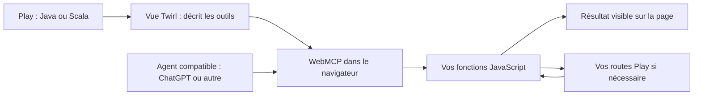
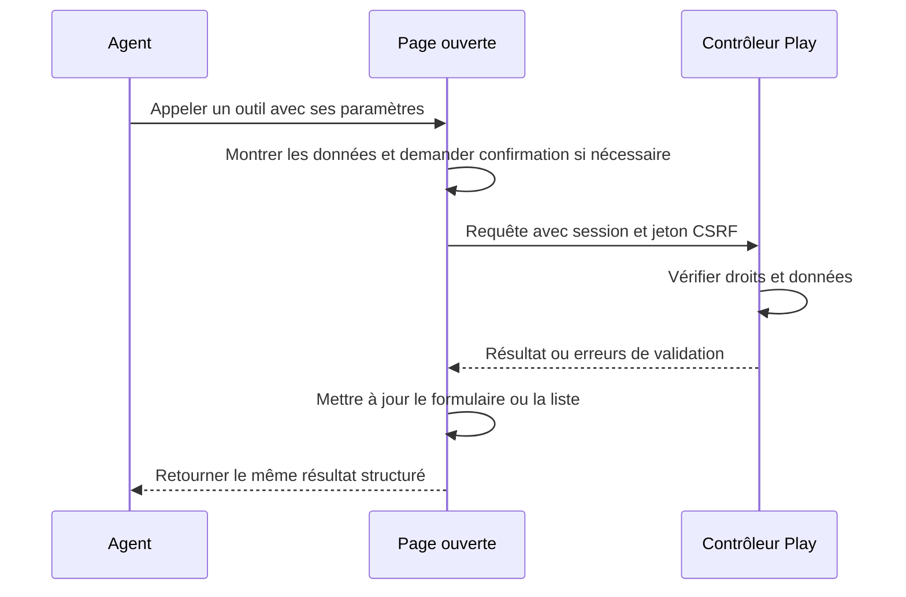

# play-webmcp

[](https://github.com/HackInvent/play-webmcp/actions/workflows/ci.yml)
[](https://github.com/HackInvent/play-webmcp/releases)
[](LICENSE)


**Ajoutez des outils WebMCP aux vues d'une application Play Java ou Scala existante.** Un agent compatible peut appeler ces outils pendant que l'utilisateur voit les résultats sur la même page.

Le module fournit des helpers Twirl et un petit fichier JavaScript sans dépendance navigateur. Vous choisissez les actions exposées et réutilisez le JavaScript, les routes et les autorisations de votre application.

**Version expérimentale 0.1.0.** WebMCP évolue encore. Le support dépend à la fois du navigateur et de l'agent. [Compatibilité](#navigateurs-et-agents) · [Installation](#installation) · [Premier outil](#un-premier-outil-en-deux-fichiers) · [Exemples](#essayer-les-applications-java-et-scala) · [Tests](#développer-et-tester)

## Comment cela fonctionne



Deux modes sont disponibles :

| Mode | Utilisation | Helper |
| --- | --- | --- |
| JavaScript, dit **impératif** | Recherche, tableau de bord, formulaire, action de votre application. Chemin recommandé pour ChatGPT. | `WebMcp.tool(...)` puis `registerTools(...)` |
| HTML, dit **déclaratif** | Ajouter les attributs WebMCP à un formulaire existant. | `WebMcp.formAttributes(...)` |

La bibliothèque n'envoie rien à un fournisseur d'IA. L'agent utilise la page avec les permissions et la session de l'utilisateur. Un client MCP distant qui ne visite pas la page nécessite une intégration supplémentaire : ce module ne fournit pas de serveur MCP distant.

## Prérequis

Pour intégrer le module :

- Une application **Play 3.0.10 ou 3.0.11**, avec des vues Twirl.
- **JDK 17 ou 21**. Java 11 n'est pas pris en charge par cette bibliothèque.
- **Scala 2.13.18 ou Scala 3.3.6 LTS**, versions testées. Un projet Java utilise aussi une version de Scala pour Play et Twirl.
- **sbt 1.x** ; le dépôt utilise sbt 1.11.7.
- Une route Play qui sert vos fichiers `public/`, généralement déjà présente.

Pour utiliser les outils :

- **HTTPS**, ou `localhost` pour développer.
- WebMCP activé dans le navigateur et un agent capable de l'utiliser.
- La page ouverte, et la connexion habituelle à votre application si elle en demande une.
- La politique `tools` doit autoriser la page ; sa valeur par défaut est `self`. Ne désactivez pas l'isolation par origine avec `Origin-Agent-Cluster: ?0`. Il n'est pas nécessaire d'ajouter COOP/COEP uniquement pour ce module.

Node.js est utile **pour développer et tester ce dépôt**, pas pour intégrer la bibliothèque ni pour exécuter votre application Play. Références : [prérequis Play](https://www.playframework.com/documentation/3.0.x/Requirements), [prérequis WebMCP](https://developer.chrome.com/docs/ai/webmcp).

## Installation

Dans le `build.sbt` de votre application **Java ou Scala** :

```scala
resolvers += "play-webmcp releases" at
  "https://raw.githubusercontent.com/HackInvent/play-webmcp/maven"

libraryDependencies += "io.github.alexusel" %% "play-webmcp" % "0.1.0"
```

Le double `%%` choisit l'artefact adapté à votre version de Scala, même dans un projet Java. Cette version est distribuée dans le dépôt Maven public de ce projet, **pas sur Maven Central**. Les JAR sont également disponibles dans les [releases GitHub](https://github.com/HackInvent/play-webmcp/releases).

Le dépôt est hébergé par **HackInvent**. L'identifiant Maven `io.github.alexusel` est conservé pour que les projets qui utilisent déjà la bibliothèque restent compatibles.

Relancez sbt après l'ajout. Aucun module Guice ni plugin sbt supplémentaire n'est à activer. Gardez les contrôleurs, le routage et la configuration de votre application.

Si votre application ne sert pas encore ses fichiers statiques, ajoutez cette route à `conf/routes` :

```text
GET   /assets/*file   controllers.Assets.versioned(path="/public", file: Asset)
```

Le JavaScript de la bibliothèque est fourni dans le JAR et extrait par Play sous `lib/play-webmcp/play-webmcp.js`. N'ajoutez pas une seconde route si celle des assets existe déjà.

## Un premier outil en deux fichiers

Cet exemple fonctionne dans les vues des projets **Java et Scala**. Il permet à l'agent de lire le titre de la page.

Dans votre vue `.scala.html`, ajoutez les imports après ses paramètres habituels :

```scala
@import playwebmcp.Tool
@import playwebmcp.javadsl.WebMcp
```

Placez ensuite le helper et le script **dans le contenu HTML de votre layout**, par exemple dans le bloc `@main(...) { ... }` ou avant `</body>`. Ils ne doivent pas précéder le `<!doctype html>` de la page.

```scala
@WebMcp.tool(
    Tool.create(
        "get_page_title",
        "Lire le titre de la page ouverte.",
        """{"type":"object","properties":{},"additionalProperties":false}""",
        "getPageTitle"
    ).withReadOnly(true)
)

<script type="module"
        src="@controllers.routes.Assets.versioned("javascripts/page-tools.js")"></script>
```

Créez `public/javascripts/page-tools.js` :

```javascript
import { registerTools } from '../lib/play-webmcp/play-webmcp.js';

const tools = await registerTools({
  getPageTitle: async () => ({ title: document.title })
});

console.log(tools.supported, tools.api, tools.registered);
```

`get_page_title` est le nom vu par l'agent. `getPageTitle` désigne votre fonction JavaScript. Le helper écrit du JSON dans la page ; le runtime associe cette description à la fonction que vous fournissez.

Sans WebMCP, `supported` vaut `false` et la page continue de fonctionner. Une erreur de configuration, par exemple un nom de fonction inconnu, provoque une erreur explicite. Dans une application réelle, traitez-la avec `try/catch` comme dans les exemples.

L'import est relatif au dossier `assets/javascripts/`. Adaptez-le si vos assets sont servis ailleurs. Les exemples utilisent aussi les routes inversées de Play pour fonctionner avec un préfixe d'application.

## API Java et Scala

Vous pouvez préparer les métadonnées dans un contrôleur Java et passer l'objet à la vue :

```java
import playwebmcp.Tool;

Tool search = Tool.create(
    "search_products",
    "Rechercher des produits par nom.",
    "{\"type\":\"object\",\"properties\":{\"query\":{\"type\":\"string\"}},\"required\":[\"query\"]}",
    "searchProducts"
).withReadOnly(true);
```

La vue reçoit `@(search: playwebmcp.Tool)` et écrit `@playwebmcp.javadsl.WebMcp.tool(search)`. Voir le [contrôleur Java complet](examples/java/app/controllers/javaexample/HomeController.java) et sa [vue](examples/java/app/views/javaIndex.scala.html).

Une API Scala accepte directement un objet Play JSON :

```scala
import play.api.libs.json.Json
import playwebmcp.scaladsl.WebMcp

val metadata = WebMcp.tool(
  name = "search_products",
  description = "Rechercher des produits par nom.",
  inputSchema = Json.obj(
    "type" -> "object",
    "properties" -> Json.obj("query" -> Json.obj("type" -> "string")),
    "required" -> Json.arr("query")
  ),
  handler = "searchProducts",
  readOnly = true
)
```

`metadata` est un `Html` Twirl, à afficher avec `@metadata`. Vous pouvez aussi appeler le helper directement dans la vue, comme dans l'[exemple Scala](examples/scala/app/views/scalaIndex.scala.html).

Le schéma décrit les paramètres attendus ; il ne remplace pas la validation serveur. Les noms d'outils acceptent 1 à 128 lettres ASCII, chiffres, points, tirets ou underscores. Les descriptions sont obligatoires. Les fonctions JavaScript sont fournies explicitement, sans `eval` ni recherche automatique dans les variables globales.

## Ajouter WebMCP à un formulaire existant

```scala
@import playwebmcp.javadsl.WebMcp

<form action="@controllers.routes.SupportController.submit()" method="post"
      @WebMcp.formAttributes("send_support_form", "Remplir une demande de support.")>
    @helper.CSRF.formField
    <label for="message">Votre demande</label>
    <textarea id="message" name="message" required
              @WebMcp.paramDescription("Décrire le problème à résoudre.")></textarea>
    <button type="submit">Envoyer</button>
</form>
```

Adaptez le nom du contrôleur à votre route existante. Par défaut, **l'utilisateur clique sur Envoyer**. Le troisième argument `true` de `formAttributes` ajoute `toolautosubmit` : utilisez-le uniquement pour une action que vous souhaitez réellement laisser soumettre automatiquement.

Les attributs sont échappés et les champs restent des champs HTML ordinaires. Une soumission classique peut changer de page. Elle ne fournit pas automatiquement un résultat JSON à l'agent. Pour un retour structuré et le support ChatGPT, utilisez un outil impératif comme dans les applications d'exemple. La [documentation déclarative Chrome](https://developer.chrome.com/docs/ai/webmcp/declarative-api) décrit aussi `respondWith()`.

## Réutiliser vos actions et afficher le résultat



Les exemples montrent une recherche et une demande de support. Leurs fonctions JavaScript utilisent `fetch`, conservent la session, transmettent le jeton CSRF déjà présent et affichent les résultats. Le serveur retourne `{ok: true, ...}` ou `{ok: false, errors: ...}`. Le module préserve le résultat renvoyé par votre fonction.

Le contexte d'exécution fourni par le navigateur est transmis comme deuxième argument au handler. Si un signal d'annulation est présent, passez `context.signal` à `fetch`, comme dans les exemples.

Conservez les contrôles d'accès et la validation dans vos actions Play. Une description ou `readOnlyHint` aide l'agent à comprendre une action ; ce n'est pas un contrôle d'autorisation. Les métadonnées sont visibles dans la page : elles ne doivent contenir aucun secret. Les exemples demandent une confirmation avant une demande de support ; ils valident cette demande sans la stocker.

## Navigateurs et agents

État documenté au **6 septembre 2026**. « Documenté » signifie annoncé dans la source officielle ; cela ne vaut pas test de votre compte, de votre modèle ou de votre version de navigateur.

| Environnement | Support et limites | Vérification |
| --- | --- | --- |
| **Chrome** | API impérative et déclarative expérimentales. Origin trial depuis Chrome 149 ; flag local disponible. | Tests natifs automatisés sur Chrome for Testing 153.0.8010.12. [Chrome](https://developer.chrome.com/docs/ai/webmcp) |
| **ChatGPT, navigateur intégré de l'application desktop** | Les outils impératifs de la page principale sont pris en charge selon l'accès au produit et le modèle. Les formulaires déclaratifs et les iframes ne le sont pas actuellement. | Compatibilité de l'API documentée ; aucun test avec un compte ChatGPT n'est revendiqué ici. [OpenAI](https://learn.chatgpt.com/docs/webmcp) |
| **Edge** | WebMCP est listé dans les origin trials des versions 150–152. La présence du navigateur ne garantit pas que Copilot appelle vos outils. | Documenté, non testé par cette CI. [Microsoft](https://learn.microsoft.com/en-us/microsoft-edge/web-platform/release-notes/152) |
| **Agent personnalisé ou extension** | Utilisable si l'agent sait découvrir et invoquer les outils WebMCP de la page. Aucun fournisseur de modèle n'est imposé. | À tester avec votre agent. [Spécification](https://webmachinelearning.github.io/webmcp/) |
| **Firefox, Safari, navigateur sans API** | La page humaine reste utilisable. Aucun support natif WebMCP n'est annoncé par ce projet. | Le scénario sans WebMCP est testé dans Chromium. |

### Avec ChatGPT

1. Ouvrez votre application dans le navigateur intégré à ChatGPT desktop.
2. Connectez-vous à votre application si nécessaire.
3. Consultez les outils de site disponibles dans la barre du navigateur.
4. Essayez : « Lis le titre de cette page », ou « Recherche un clavier » dans les exemples.

Utilisez le mode impératif dans la page principale. Consultez la [page officielle](https://learn.chatgpt.com/docs/webmcp) pour les modèles, comptes et versions actuellement éligibles. Ouvrir le site ChatGPT dans un onglet Chrome n'est pas équivalent à utiliser son navigateur intégré.

### Avec Chrome ou Edge

Pour Chrome en développement, activez `chrome://flags/#enable-webmcp-testing`, puis redémarrez le navigateur. Pour un déploiement public expérimental, suivez les instructions de l'origin trial. L'inspecteur **Model Context Tool Inspector**, lié depuis la [documentation Chrome](https://developer.chrome.com/docs/ai/webmcp), permet de voir et d'appeler les outils. Cet inspecteur est distinct de Gemini dans Chrome.

Pour Edge, vérifiez la version et les conditions du [trial Microsoft](https://developer.microsoft.com/en-us/microsoft-edge/origin-trials/trials/0b76fe60-b266-458e-a285-04e375c0c31a).

### Avec votre propre agent

Le runtime enregistre des outils WebMCP standards. Votre agent utilise les interfaces de découverte et d'exécution fournies par le navigateur ou son extension. Le module ne contient ni modèle ni boucle de conversation.

Attention à la version de l'API si vous écrivez ce client : Chromium 153 attend des arguments JSON sérialisés pour `executeTool`, tandis que le draft du 4 septembre décrit un objet. Choisissez le format avant l'appel ; ne relancez pas automatiquement une opération d'écriture pour essayer un autre format. Le [test natif](tests/browser.mjs) illustre cette distinction. Sources : [IDL Chromium testé](https://chromium.googlesource.com/chromium/src/+/153.0.8010.12/third_party/blink/renderer/core/script_tools/model_context.idl), [draft](https://webmachinelearning.github.io/webmcp/).

## Cycle de vie, CSP et limites

- `registerTools` préfère `document.modelContext`. Il utilise `navigator.modelContext` si seule cette ancienne API est disponible et indique le choix dans `api`.
- Appelez-le une fois par vue. Après un remplacement dynamique de vue, faites `await tools.dispose()` avant de réenregistrer les outils. Vérifiez `remaining` et `errors` sur les anciennes API.
- L'option `signal` permet d'annuler l'enregistrement. L'API actuelle retire les outils avec `AbortController` ; les anciennes implémentations utilisent `unregisterTool` lorsqu'il existe.
- Sans API, `supported` vaut `false`. Une erreur d'enregistrement déclenche un nettoyage des outils déjà ajoutés et expose les éventuels échecs de nettoyage.
- Le helper produit du JSON inerte et le code s'exécute dans un fichier externe. Autorisez ce fichier dans votre CSP habituelle ; aucune règle `unsafe-inline` ou `unsafe-eval` n'est nécessaire au module. Si votre CSP impose un nonce sur les scripts externes, conservez le helper de nonce déjà utilisé dans votre application.
- Ne donnez pas le même nom à un outil déclaratif et à un outil impératif de la page. Le runtime ne contrôle pas les outils enregistrés par une autre bibliothèque.
- Les routes ne deviennent pas automatiquement des outils. Chaque action exposée et chaque handler restent explicites.
- Play 2.x, Play 3.1 en préversion, les autres versions Scala et les autres couples navigateur/agent ne font pas partie de la matrice de tests actuelle.

## Essayer les applications Java et Scala

```bash
git clone https://github.com/HackInvent/play-webmcp.git
cd play-webmcp
sbt "javaExample/run 19001"
```

Ouvrez `http://localhost:19001`. Pour Scala, dans un autre terminal :

```bash
sbt "scalaExample/run 19002"
```

Ouvrez `http://localhost:19002`. Chaque page contient une recherche, un formulaire de support et un état WebMCP visible. Les exemples utilisent une liste de produits fixe et ne stockent pas les demandes. Leurs clés de session sont des clés de démonstration locales ; utilisez votre propre configuration pour déployer une application.

## Développer et tester

Prérequis supplémentaires : **Node.js 22** pour les tests navigateur, npm et les dépendances système de Chromium. Avec JDK 17 ou 21 sélectionné :

```bash
sbt +test
npm ci
npm test
npx playwright install --with-deps chromium
sbt javaExample/stage scalaExample/stage
bash scripts/browser-check.sh
```

Le dernier script démarre et arrête ses propres applications sur les ports 19001 et 19002. Ces ports doivent être libres. Pour une application déjà démarrée :

```bash
BASE_URL=http://localhost:19001 npm run test:browser
```

Les vérifications couvrent :

- Les APIs Java et Scala, les schémas, les noms et l'échappement HTML/JSON.
- Les véritables routes et vues Play des deux applications, la validation et CSRF.
- Le runtime avec API absente, API actuelle, ancienne API, annulation et erreurs de nettoyage. Ces tests unitaires utilisent des doublures de l'API.
- Le navigateur réel : formulaires avec et sans JavaScript, asset issu du JAR, découverte et appels WebMCP natifs, confirmation et annulation d'une écriture. Ces tests n'installent pas de faux WebMCP et échouent si l'API native manque.

La [CI](https://github.com/HackInvent/play-webmcp/actions/workflows/ci.yml) croise Play 3.0.10/3.0.11, Scala 2.13.18/3.3.6 et Java 17/21. Le navigateur est fixé par `package-lock.json` pour rendre les tests reproductibles.

Pour vérifier l'installation des JAR publics dans des projets indépendants :

```bash
bash scripts/consumer-check.sh
```

Ce script crée deux applications temporaires, télécharge le module depuis le dépôt Maven public et teste leurs routes et leurs vues avec les deux versions Scala. Il vérifie aussi que Play sert le JavaScript inclus dans le JAR.

Pour essayer une modification locale dans votre propre projet :

```bash
sbt +webmcp/publishLocal
```

Gardez ensuite la même ligne `libraryDependencies` dans le projet consommateur. Les artefacts publiés localement seront disponibles sur votre machine.

## Dépannage

| Symptôme | À vérifier |
| --- | --- |
| `supported: false` | Activation de WebMCP, contexte HTTPS/localhost, politique `tools` et version du navigateur. |
| Aucun outil dans ChatGPT | Navigateur intégré, accès aux outils de site, mode impératif et page principale. |
| JavaScript en 404 | Route assets existante et chemin `lib/play-webmcp/play-webmcp.js`, sans numéro de version. |
| `unknown handler` | Le champ `handler` doit correspondre à une fonction passée à `registerTools`. |
| POST refusé avec 403 | Session, jeton CSRF du formulaire et autorisation serveur. Corrigez leur transmission. |
| Erreur de compilation Scala | Le suffixe de l'artefact et la version Scala de votre projet doivent correspondre ; utilisez `%%` avec sbt. |
| Outil encore présent après remplacement de vue | Appelez `dispose()` et examinez les erreurs de nettoyage avant un nouvel enregistrement. |

## Contribuer et licence

Les changements sont livrés par petits commits : bibliothèque, runtime, exemples, tests puis documentation et distribution. Proposez une correction avec un exemple reproductible dans les [issues](https://github.com/HackInvent/play-webmcp/issues) ou une pull request. Gardez la documentation dans ce README et vérifiez les scénarios touchés par votre modification.

Licence [MIT](LICENSE). Projet communautaire indépendant de Play Framework, OpenAI, Google et Microsoft.
