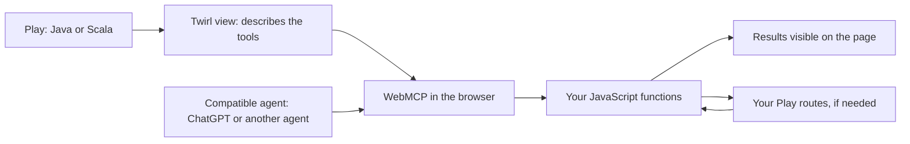
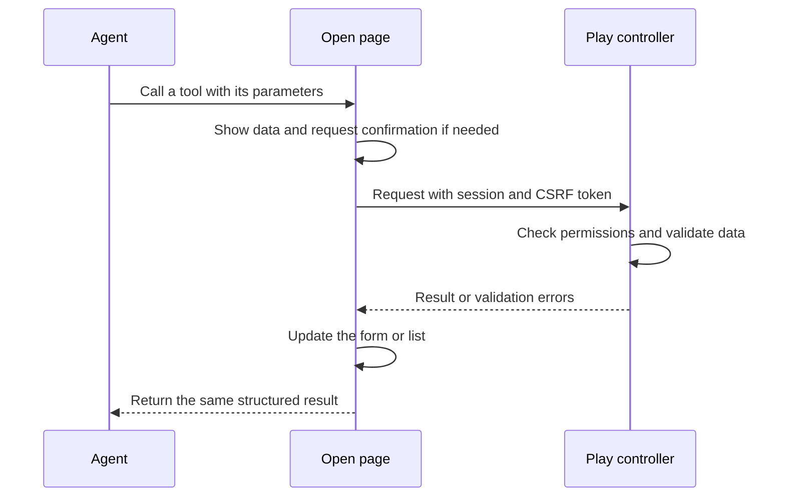
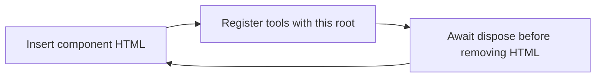

# play-webmcp

[](https://github.com/HackInvent/play-webmcp/actions/workflows/ci.yml)
[](https://github.com/HackInvent/play-webmcp/releases)
[](LICENSE)


**Add WebMCP tools to the views of an existing Play Java or Scala application.** A compatible agent can call these tools while the user sees the results on the same page.

The module provides Twirl helpers and a small JavaScript file with no browser dependencies. You choose which actions to expose and reuse your application's JavaScript, routes, and permissions.

**Experimental version 0.3.0.** WebMCP is still evolving. Support depends on both the browser and the agent. [Compatibility](#browsers-and-agents) · [Add to your site](#installation) · [First tool](#your-first-tool-in-two-files) · [Dynamic views](#components-and-pages-updated-without-a-reload) · [Examples](#try-the-java-and-scala-applications) · [Tests](#development-and-testing)

## How it works



Two modes are available:

| Mode | Use case | Helper |
| --- | --- | --- |
| JavaScript, known as **imperative** | Search, dashboards, forms, and application actions. Recommended for ChatGPT. | `WebMcp.tool(...)` then `registerTools(...)` |
| HTML, known as **declarative** | Add WebMCP attributes to an existing form. | `WebMcp.formAttributes(...)` |

The library does not send anything to an AI provider. The agent uses the page with the user's permissions and session. A remote MCP client that does not visit the page needs additional integration: this module does not provide a remote MCP server.

## Prerequisites

To integrate the module:

- An existing **Play 3.0.x** application with Twirl HTML views. The installation tests cover every stable release from **3.0.0 through 3.0.11**.
- **JDK 11, 17, or 21**, as supported by your application. The module targets Java 11 bytecode.
- **Scala 2.13 or Scala 3**, supported by your Play version. The JARs are built with Scala **2.13.12** and **3.3.1**; these minimum versions and **2.13.18 / 3.3.6** are tested. Java projects also use Scala for Play and Twirl. Keep your existing compatible Scala version.
- Your application's existing **sbt 1.x** setup; this repository uses sbt 1.11.7.
- A Play route that serves your `public/` files, which most applications already have.

To use the tools:

- **HTTPS**, or `localhost` for development.
- WebMCP enabled in the browser and an agent that can use it.
- The page open, with the user signed in to your application if required.
- The `tools` permissions policy must allow the page; its default is `self`. Do not disable origin isolation with `Origin-Agent-Cluster: ?0`. You do not need to add COOP/COEP just for this module.

Node.js is useful **for developing and testing this repository**, but is not required to integrate the library or run your Play application. References: [Play requirements](https://www.playframework.com/documentation/3.0.x/Requirements), [WebMCP requirements](https://developer.chrome.com/docs/ai/webmcp).

## Installation

**Add the dependency to your existing site; you do not need to clone this repository.** Start with one page and one action. The steps are the same for Java and Scala projects.

| File in your application | Change |
| --- | --- |
| `build.sbt` | Add the Maven resolver and library dependency. |
| `conf/routes` | Reuse your assets route, or add one if it is missing. |
| Your existing `.scala.html` view or layout | Describe the tool and load its JavaScript. |
| `public/javascripts/page-tools.js` | Connect the tool to your JavaScript function. |

### 1. Add the dependency

In your **Java or Scala** application's `build.sbt`:

```scala
resolvers += "play-webmcp releases" at
  "https://raw.githubusercontent.com/HackInvent/play-webmcp/maven"

libraryDependencies += "io.github.alexusel" %% "play-webmcp" % "0.3.0"
```

The double `%%` selects the artifact for your Scala version, including in Java projects. This version is distributed through the project's public Maven repository, **not Maven Central**. The JARs are also available in the [GitHub releases](https://github.com/HackInvent/play-webmcp/releases).

The repository is hosted by **HackInvent**. The Maven group ID `io.github.alexusel` is preserved so that projects already using the library remain compatible.

Restart sbt after adding the dependency. The library declares Play as a provided dependency: your application supplies its own Play version. Keep your existing `PlayJava` or `PlayScala` plugin, controllers, dependency injection, session settings, and server backend. No WebMCP plugin, Guice module, API key, or additional server is needed.

For a build with several subprojects, put **both settings on the Play subproject that renders the views**, not just on the root that aggregates them. For example, add these entries to its existing `.settings(...)`:

```scala
resolvers += "play-webmcp releases" at
  "https://raw.githubusercontent.com/HackInvent/play-webmcp/maven",
libraryDependencies += "io.github.alexusel" %% "play-webmcp" % "0.3.0"
```

Upgrading from 0.1.0 or 0.2.0: change the dependency version to `0.3.0`, then run `sbt clean update` before rebuilding. Play can otherwise keep an older extracted WebJar file in `target/`. Existing helper calls and the public runtime path stay the same.

### 2. Reuse your assets route

If your application does not already serve static files, add this route to `conf/routes`:

```text
GET   /assets/*file   controllers.Assets.versioned(path="/public", file: Asset)
```

The library's JavaScript is bundled in the JAR and extracted by Play to `lib/play-webmcp/play-webmcp.js`. Do not add a second route if your assets route already exists. Do not include `0.3.0` in this public path.

The example below uses `Assets.versioned`. If your application uses `Assets.at` or an injected `AssetsFinder`, use that same helper for **both JavaScript URLs**:

| Existing asset setup | Example runtime URL expression in Twirl |
| --- | --- |
| `Assets.versioned` with the route above | `@controllers.routes.Assets.versioned("lib/play-webmcp/play-webmcp.js")` |
| `Assets.at` with a fixed `/public` route | `@controllers.routes.Assets.at("lib/play-webmcp/play-webmcp.js")` |
| An `AssetsFinder` passed as `assetsFinder` | `@assetsFinder.path("lib/play-webmcp/play-webmcp.js")` |

This also works with a custom assets route such as `/static/*file`. Keep your existing asset pipeline and CSP. The template passes the runtime URL to JavaScript, so the handler file does not have to assume where assets are hosted. See [Play's asset documentation](https://www.playframework.com/documentation/3.0.x/AssetsOverview) for route overloads and asset configuration.

## Your first tool in two files

This example works in the views of both **Java and Scala** projects. It lets the agent read the page title.

### 3. Describe a tool in your existing view

In your `.scala.html` view, add the imports after the usual template parameters:

```scala
@import playwebmcp.Tool
@import playwebmcp.javadsl.WebMcp
```

Then place the helper and script **inside your layout's HTML content**, for example inside the `@main(...) { ... }` block or before `</body>`. They must not appear before the page's `<!doctype html>`.

```scala
@WebMcp.tool(
    Tool.create(
        "get_page_title",
        "Read the title of the open page.",
        """{"type":"object","properties":{},"additionalProperties":false}""",
        "getPageTitle"
    ).withReadOnly(true)
)

<script id="page-tools" type="module"
        data-webmcp-runtime="@controllers.routes.Assets.versioned("lib/play-webmcp/play-webmcp.js")"
        src="@controllers.routes.Assets.versioned("javascripts/page-tools.js")"></script>
```

Load this script once per page. If your shared layout already loads it, add only the tool metadata to the individual view. This first example does not require a new controller or route.

### 4. Connect the JavaScript handler

Create `public/javascripts/page-tools.js`:

```javascript
const runtimeUrl = document.getElementById('page-tools').dataset.webmcpRuntime;
const { registerTools } = await import(runtimeUrl);

const tools = await registerTools({
  getPageTitle: async () => ({ title: document.title })
});

console.log(tools.supported, tools.api, tools.registered);
```

`get_page_title` is the name the agent sees. `getPageTitle` identifies your JavaScript function. The helper writes JSON into the page; the runtime connects that description to the function you provide.

Without WebMCP, `supported` is `false` and the page keeps working. A configuration mistake, such as an unknown handler name, throws an explicit error. In a real application, handle it with `try/catch`, as shown in the examples.

### 5. Check the integration

1. Start your application and open the page. Its usual buttons and forms should still work.
2. In the browser's Network tab, check that `page-tools.js` and `play-webmcp.js` return HTTP 200 with a JavaScript content type.
3. In a browser with WebMCP enabled, check the console: `supported` should be `true` and `registered` should include `get_page_title`.
4. Use a compatible agent or the browser's tool inspector to call `get_page_title`. It should return the visible page title. Without WebMCP, `supported: false` is expected.

For a site served under a prefix such as `/shop`, keep its existing `play.http.context` and proxy configuration. Generate the script and action URLs with Play's route helpers, as shown here. Do not hard-code `/assets` or `/api` in your handlers. The browser tests run the Java and Scala examples both at `/` and under `/shop`.

Next, replace the title handler with a function that calls an existing action and updates your page. The [form example](#add-webmcp-to-an-existing-form) and [request flow](#reuse-your-actions-and-display-the-result) show how to reuse validation, permissions, session cookies, and CSRF protection.

## Java and Scala APIs

You can prepare the metadata in a Java controller and pass the object to the view:

```java
import playwebmcp.Tool;

Tool search = Tool.create(
    "search_products",
    "Search for products by name.",
    "{\"type\":\"object\",\"properties\":{\"query\":{\"type\":\"string\"}},\"required\":[\"query\"]}",
    "searchProducts"
).withReadOnly(true);
```

The view accepts `@(search: playwebmcp.Tool)` and renders `@playwebmcp.javadsl.WebMcp.tool(search)`. See the [complete Java controller](examples/java/app/controllers/javaexample/HomeController.java) and its [view](examples/java/app/views/javaIndex.scala.html).

The Scala API accepts a Play JSON object directly:

```scala
import play.api.libs.json.Json
import playwebmcp.scaladsl.WebMcp

val metadata = WebMcp.tool(
  name = "search_products",
  description = "Search for products by name.",
  inputSchema = Json.obj(
    "type" -> "object",
    "properties" -> Json.obj("query" -> Json.obj("type" -> "string")),
    "required" -> Json.arr("query")
  ),
  handler = "searchProducts",
  readOnly = true
)
```

`metadata` is a Twirl `Html` value, rendered with `@metadata`. You can also call the helper directly in the view, as in the [Scala example](examples/scala/app/views/scalaIndex.scala.html).

The schema describes the expected parameters; it does not replace server validation. Tool names must contain 1 to 128 ASCII letters, digits, dots, hyphens, or underscores. Descriptions are required. JavaScript functions are provided explicitly, without `eval` or automatic lookup in global variables.

## Add WebMCP to an existing form

```scala
@import playwebmcp.javadsl.WebMcp

<form action="@controllers.routes.SupportController.submit()" method="post"
      @WebMcp.formAttributes("send_support_form", "Fill in a support request.")>
    @helper.CSRF.formField
    <label for="message">Your request</label>
    <textarea id="message" name="message" required
              @WebMcp.paramDescription("Describe the problem to solve.")></textarea>
    <button type="submit">Send</button>
</form>
```

Adjust the controller name to match your existing route. By default, **the user clicks Send**. Passing `true` as the third argument to `formAttributes` adds `toolautosubmit`: use it only for an action you intend to allow automatic submission for.

Attributes are escaped, and the fields remain ordinary HTML fields. A regular submission may navigate to another page. It does not automatically return a JSON result to the agent. For a structured response and ChatGPT support, use an imperative tool as shown in the example applications. The [Chrome declarative API documentation](https://developer.chrome.com/docs/ai/webmcp/declarative-api) also describes `respondWith()`.

## Reuse your actions and display the result



The examples demonstrate a search and a support request. Their JavaScript functions use `fetch`, preserve the session, pass the existing CSRF token, and display the results. The server returns `{ok: true, ...}` or `{ok: false, errors: ...}`. The module preserves the result returned by your function.

The execution context supplied by the browser is passed as the handler's second argument. If a cancellation signal is available, pass `context.signal` to `fetch`, as in the examples.

Keep access checks and validation in your Play actions. A description or `readOnlyHint` helps the agent understand an action; it is not an authorization check. Metadata is visible in the page and must not contain secrets. The examples ask for confirmation before a support request and validate it without storing it.

## Browsers and agents

Documented status as of **September 6, 2026**. “Documented” means stated in the official source; it does not mean tested with your account, model, or browser version.

| Environment | Support and limitations | Verification |
| --- | --- | --- |
| **Chrome** | Experimental imperative and declarative APIs. Origin trial since Chrome 149; a local flag is available. | Automated native tests on Chrome for Testing 153.0.8010.12. [Chrome](https://developer.chrome.com/docs/ai/webmcp) |
| **ChatGPT, built-in browser in the desktop app** | Imperative tools on the top-level page are supported depending on product access and model. Declarative forms and iframes are not currently supported. | API compatibility is documented; this project does not claim testing with a ChatGPT account. [OpenAI](https://learn.chatgpt.com/docs/webmcp) |
| **Edge** | WebMCP is listed in the origin trials for versions 150–152. Using the browser does not guarantee that Copilot will call your tools. | Documented, not tested by this CI. [Microsoft](https://learn.microsoft.com/en-us/microsoft-edge/web-platform/release-notes/152) |
| **Custom agent or extension** | Works if the agent can discover and invoke the page's WebMCP tools. No specific model provider is required. | Test with your agent. [Specification](https://webmachinelearning.github.io/webmcp/) |
| **Firefox, Safari, or a browser without the API** | The page remains usable by people. This project does not claim native WebMCP support. | The scenario without WebMCP is tested in Chromium. |

### With ChatGPT

1. Open your application in the built-in browser of the ChatGPT desktop app.
2. Sign in to your application if needed.
3. Check the available site tools in the browser toolbar.
4. Try “Read the title of this page” with the first-tool example, or “Search for the product named Clavier” in the demo applications. Their sample product names are in French; “Clavier” means “keyboard”.

Use imperative tools on the top-level page. See the [official page](https://learn.chatgpt.com/docs/webmcp) for currently eligible models, accounts, and versions. Opening the ChatGPT website in a Chrome tab is not equivalent to using its built-in browser.

### With Chrome or Edge

For local Chrome development, enable `chrome://flags/#enable-webmcp-testing`, then restart the browser. For an experimental public deployment, follow the origin trial instructions. **Model Context Tool Inspector**, linked from the [Chrome documentation](https://developer.chrome.com/docs/ai/webmcp), lets you inspect and call the tools. This inspector is separate from Gemini in Chrome.

For Edge, check the version and requirements of the [Microsoft trial](https://developer.microsoft.com/en-us/microsoft-edge/origin-trials/trials/0b76fe60-b266-458e-a285-04e375c0c31a).

### With your own agent

The runtime registers standard WebMCP tools. Your agent uses the discovery and execution interfaces provided by the browser or its extension. The module contains neither a model nor a conversation loop.

Check the API version when writing this client: Chromium 153 expects serialized JSON arguments for `executeTool`, while the September 4 draft describes an object. Choose the format before calling the tool; do not automatically retry a write operation to try another format. The [native test](tests/browser.mjs) illustrates this distinction. Sources: [tested Chromium IDL](https://chromium.googlesource.com/chromium/src/+/153.0.8010.12/third_party/blink/renderer/core/script_tools/model_context.idl), [draft](https://webmachinelearning.github.io/webmcp/).

## Components and pages updated without a reload

Since **0.3.0**, `registerTools(handlers, { root })` can read tool metadata from a single HTML container. This is useful for a cart, search panel, or any view that your application replaces without loading a new page. Each call returns its own registration object. Calling `dispose()` on it removes only the tools registered by that call.

Use a separate `root` for each independent component. Each root includes all its descendants, so registered roots must not overlap. Do not also register the same metadata through a whole-page call. Tool names must still be unique across the page: for example, `cart.read` and `catalog.search`.

Using the same `Tool` and `WebMcp` imports as above, render the metadata inside the component:

```scala
<section id="cart-panel">
    <span data-item-count>2</span> items in your cart
    @WebMcp.tool(
        Tool.create(
            "cart.read",
            "Read the item count displayed in the cart.",
            """{"type":"object","properties":{},"additionalProperties":false}""",
            "readCart"
        ).withReadOnly(true)
    )
</section>
```

In your external JavaScript module, use the `registerTools` import shown in the first-tool example:

```javascript
export async function attachCartTools(root) {
  const tools = await registerTools({
    readCart: async () => ({
      items: Number(root.querySelector('[data-item-count]').textContent)
    })
  }, { root });

  return async function detachCartTools() {
    const cleanup = await tools.dispose();
    if (cleanup.remaining.length > 0) {
      throw new Error('Cart tools could not be removed. Reload the page before replacing the component.');
    }
  };
}
```

After inserting the HTML, keep its cleanup function:

```javascript
const detachCartTools = await attachCartTools(document.getElementById('cart-panel'));
```

Before removing or replacing that HTML, run `await detachCartTools()`. Then insert the new component and call `attachCartTools` again. Finish cleanup before mounting the replacement. Your application controls these steps; the module does not watch the DOM or register newly inserted tools automatically.



`root` must be a container in the same document. With WebMCP available, a missing container (`null`) raises an error before any tools are registered. An empty container registers no tools. Omitting `root` keeps the original behavior of reading the whole document. You can also pass your component's `AbortSignal` with `{ root, signal }`; await `dispose()` when you need to check cleanup errors from an older API.

## Lifecycle, CSP, and limitations

- `registerTools` prefers `document.modelContext`. It uses `navigator.modelContext` if only that older API is available and reports the choice in `api`.
- Call it once per view or component. Before replacing its HTML, call `await tools.dispose()`, then register the replacement. Check `remaining` and `errors` when using older APIs.
- The `signal` option lets you cancel registration. The current API removes tools through `AbortController`; older implementations use `unregisterTool` when available.
- Without the API, `supported` is `false`. A registration error triggers cleanup of tools already added and exposes any cleanup failures.
- The helper produces inert JSON, and the code runs in an external file. Allow that file in your usual CSP; the module does not require `unsafe-inline` or `unsafe-eval`. If your CSP requires a nonce on external scripts, keep using your application's existing nonce helper.
- Do not give a declarative tool and an imperative tool on the page the same name. The runtime does not manage tools registered by another library.
- Routes do not automatically become tools. Each exposed action and handler must be provided explicitly.
- Play 2.x and Play 3.1 previews are outside the current test matrix. Future Play 3.x releases and other Scala or browser/agent combinations need verification before they can be claimed as supported.

## Try the Java and Scala applications

```bash
git clone https://github.com/HackInvent/play-webmcp.git
cd play-webmcp
sbt "javaExample/run 19001"
```

Open `http://localhost:19001`. For Scala, use another terminal:

```bash
sbt "scalaExample/run 19002"
```

Open `http://localhost:19002`. Each page contains a search, a support form, and a visible WebMCP status. The Java example serves assets through `/static`; the Scala example uses `/assets`. Both use URLs generated by Play. The demo interfaces and sample product names are currently in French. The examples use a fixed product list and do not store requests. Their session keys are local demo keys; use your own configuration when deploying an application.

## Development and testing

Additional prerequisites: **Node.js 22** for browser tests, npm, and Chromium's system dependencies. With JDK 11, 17, or 21 selected:

```bash
sbt +test
npm ci
npm test
npx playwright install --with-deps chromium
sbt javaExample/stage scalaExample/stage
bash scripts/browser-check.sh
```

After editing the runtime or changing the module version, run `sbt clean` before building the examples again. This removes extracted WebJar files that Play may otherwise reuse.

The last script starts and stops its own applications on ports 19001 and 19002. These ports must be free. To test an application that is already running:

```bash
BASE_URL=http://localhost:19001 npm run test:browser
```

The checks cover:

- Java and Scala APIs, schemas, names, and HTML/JSON escaping.
- The real Play routes and views in both applications, validation, and CSRF protection.
- The runtime with no API, the current API, the older API, cancellation, cleanup errors, and independent component registration. These unit tests use API test doubles.
- A real browser: forms with and without JavaScript, the asset from the JAR, native WebMCP discovery and calls, component replacement that preserves other tools, and confirmation and cancellation of a write operation. These tests do not install a fake WebMCP API and fail if the native API is missing.

The [CI](https://github.com/HackInvent/play-webmcp/actions/workflows/ci.yml) builds the distributable JARs once against Play 3.0.0, Scala 2.13.12/3.3.1, and Java 11. Independent Java and Scala applications then install those same JARs:

| Installation check | Versions |
| --- | --- |
| Every stable Play 3.0 release | 3.0.0–3.0.11, with Scala 2.13.18 and 3.3.6 on Java 11 |
| Minimum Scala versions | Play 3.0.0 with Scala 2.13.12 and 3.3.1 on Java 11 |
| Additional JDKs | Play 3.0.11 with both Scala families on Java 17 and 21 |
| Browser integration | Java `/static` and Scala `/assets`, both at `/` and `/shop`; native tool calls, component replacement, and ordinary forms |

The installation tests also compare the application's Play and Scala dependencies before and after adding the module. The browser version is pinned by `package-lock.json` to make tests reproducible.

To verify installation of the public JARs in independent projects:

```bash
bash scripts/consumer-check.sh
```

This script creates two temporary applications, downloads the module from the public Maven repository, and tests their routes and views with both Scala versions. It also checks that Play serves the JavaScript included in the JAR. To check a particular existing stack, set `PLAY_VERSION` and pass its Scala version:

```bash
PLAY_VERSION=3.0.0 bash scripts/consumer-check.sh 2.13.12
PLAY_VERSION=3.0.11 bash scripts/consumer-check.sh 3.3.6
WEBMCP_TEST_CONTEXT_PATH=/shop bash scripts/browser-check.sh
```

The consumer script uses your selected `JAVA_HOME`. `WEBMCP_VERSION` and `WEBMCP_REPOSITORY` can select a different module release or a local Maven repository.

To try a local change in your own project:

```bash
sbt +webmcp/publishLocal
```

Keep the same `libraryDependencies` line in the consuming project, then run `sbt clean update` there before rebuilding. The locally published artifacts will be available on your machine.

## Troubleshooting

| Symptom | What to check |
| --- | --- |
| `supported: false` | WebMCP enabled, HTTPS/localhost context, `tools` policy, and browser version. |
| No tools in ChatGPT | Built-in browser, access to site tools, imperative mode, and top-level page. |
| JavaScript returns 404 | Existing assets route, `data-webmcp-runtime` generated by Play, and the path `lib/play-webmcp/play-webmcp.js` without a version number. Put the dependency on the subproject that serves the page. |
| Asset build rejects `import` or `await` | These files are ES modules. Use a module-aware asset step, or exclude them from an older minifier while keeping the rest of your pipeline. |
| Old runtime after an upgrade | Run `sbt clean update`, rebuild, and reload the page. Play may keep an older extracted WebJar file in `target/`. |
| `unknown handler` | The `handler` field must match a function passed to `registerTools`. |
| POST rejected with 403 | Session, form CSRF token, and server authorization. Make sure the request sends the required session and token. |
| `UnsupportedClassVersionError` on Java 11 | Use module 0.2.0 or later; 0.1.0 required Java 17. |
| Scala compilation error | The artifact suffix must match your project's Scala version; use `%%` with sbt. |
| `root must be a document or a DOM container` | The component selector returned `null`, or `root` is not a DOM container. Insert the component HTML before registering its tools. |
| Tool still present after a view replacement | Call `dispose()` and inspect cleanup errors before registering again. |

## Contributing and license

Changes are delivered through small commits: library, runtime, examples, tests, then documentation and distribution. Suggest a fix with a reproducible example in the [issues](https://github.com/HackInvent/play-webmcp/issues) or submit a pull request. Keep the documentation in this README and check the scenarios affected by your change.

[MIT](LICENSE) license. A community project independent of Play Framework, OpenAI, Google, and Microsoft.
