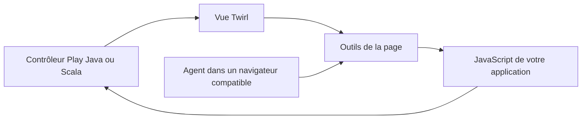

# play-webmcp

Ajouter des outils WebMCP aux vues d'un projet Play Java ou Scala existant.

## Travail par incréments

1. Socle de compilation et dépôt public.
2. Helpers Java et Scala pour les vues, avec tests.
3. Runtime navigateur indépendant du fournisseur d'agent.
4. Applications Java et Scala exécutables, tests d'intégration et CI.
5. Installation, compatibilité, schémas et première version distribuable.

Chaque incrément fait l'objet d'un commit. Cette page rassemble toute la documentation.

## Principe

## Prérequis prévus

- Play 3.0.x, Java 17 ou 21 et sbt.
- Scala 2.13 ou Scala 3 LTS, y compris pour le moteur de vues des projets Java.
- HTTPS en production, ou localhost pour développer.
- Un navigateur et un agent qui savent utiliser WebMCP.

## Compatibilité à connaître

WebMCP évolue encore. Le mode impératif JavaScript sera le chemin principal : le navigateur intégré à ChatGPT ne prend pas actuellement en charge les formulaires WebMCP déclaratifs. Chrome propose les deux API sous les conditions décrites dans sa documentation. Le support Edge et des autres agents doit être vérifié pour la version utilisée.

Sources : [OpenAI](https://learn.chatgpt.com/docs/webmcp), [Chrome](https://developer.chrome.com/docs/ai/webmcp), [Play](https://www.playframework.com/documentation/3.0.x/Requirements).

## Licence

MIT — voir [LICENSE](LICENSE).
